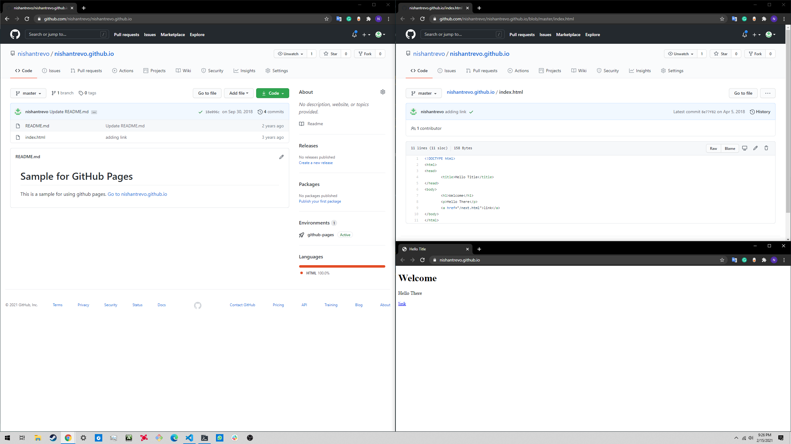

# My First Blog.... After so long

    "your own code after few months feels like someone else's"
    "only sane thing to do after reading someone else's code is to re-write it"

So finally I am retiring my old [blog](http://nishantrevo.blogspot.com/). Blogspot is very easy to begin with its simple editor and preview feature. It also lets you add Code snippets via Github gist if you switch to HTML view in code editor and ready to tinker. Or you can go pro and do the whole thing in pure HTML. It has ready made comment section, variety of ready made themes and few other tricks up its sleeve. So why I am switching to something else? Well:
- You are stuck with either a simple editor or HTML code. Either way you are not in control of every aspect of your blog. No way to use static site generator tools like Jekyll, Hugo or deploy your own code with something like Flask.
- Blogspot has a great and functional feature set but it looks old. Everytime I open Blogspot posts or editor, I feel tranported back to time when my Pentium Dual Core with 512MB RAM was cool and 256KB DSL internet was definition of blazing fast internet.
- To learn something new. In starting Twenties of the Twenty First century blog websites like [Medium.com](https://medium.com) or [HackerNoon](https://hackernoon.com/) are the standards. After searching how most developer are creating their blogs, I saw majority is using using site generators along with version controlled Markdown files and CI pipelines. All of this makes a lot of sense for any Software Developer. That is focusing your time and energy on writing and building the pipeline using standard developer tooling. Let it figure out creating, deploying and updating the changes.

So for this I chose [Hugo](https://gohugo.io) for generating the HTML output. Its very poplular tool with very good documentation, an active community, single binary as dependency, converts Markdown to post, lots of free themes and some more.

For hosting, I am initially choosing [Github Pages](https://pages.github.com/). Lets see how far I can go with this. If I find it restrictive, then I 'll look for alrternatives like Heroku or Google Cloud.

For pipelines, since I already have worked on it, CircleCI is my chosen workhorse for the time being. Later I think I'll switch to Github actions. It will be fun to learn Github Actions but lets focus on one thing at a time.

----------------------
## How I did it
### 1. Creating Github repos
  1. Create a github repo for blog. This will be a Hugo project containing all blog posts, content, configuration and pipeline definition. For this project, I created repo [github.com/nishantrevo/blog](https://github.com/nishantrevo/blog)
  2. Create your Github Page domain. Basically you create a repo named \<your-github-user-name>.github.io. So for me I created a public repo named `nishantrevo.github.io`. Content in master branch of this repo will served as WebPage at [https://nishantrevo.github.io](https://nishantrevo.github.io). Eg.
  

### 2. Setup Hugo project
Next is to setup our Hugo project and customise it as per my needs. Following steps are taken from Hugo [documentation](https://gohugo.io/getting-started)
#### 1. Download Hugo locally. 
  Officially, Hugo version is available mainly as Homebrew, Binary and Choco package. I could have installed Homebrew on my Ubuntu which I am using at the time of writing, but I chose rather to download `.deb` Binary package and install it myself.
```
//Download latest .deb package
wget https://github.com/gohugoio/hugo/releases/download/v0.80.0/hugo_0.80.0_Linux-64bit.deb -O hugo.deb

//Install .deb package
sudo apt install -f ./hugo.deb

//Check installation
hugo version
```
#### 2. Checkout blog repo
Before initializing the Hugo project its best checkout the blog repository created earlier and do setup inside that directory.
```
git clone https://github.com/nishantrevo/blog.git 
cd blog
```
#### 3. Initilize Hugo project
As per documentation, initilizing is simple by following command:
```
hugo new site --force .
```
- `new site` for project init. 
- `--force` to init in existing directory. 
- `.` for current directory

#### 4. Add a theme
Choose a theme from store and download it in `./theme` directory 
```
//Download theme of your choice as git submodule
git submodule add https://github.com/CaiJimmy/hugo-theme-stack/ themes/hugo-theme-stack
```
This will checkout and add [`stack`](https://themes.gohugo.io/hugo-theme-stack/) theme inside `./themes/hugo-theme-stack`

Now

setup its basic paramters in `config.toml`
#### 5. Creating first post


Explain Hugo download in CLI, setup project, commit first time in blog repo.

### 3. Write first blog
- Explain writing sample first blog, view locally, generate output.

### 4. The Pipeline 
- Explain circleci pipeline setup for blog repo, content of config with step by step description

## Conclusion